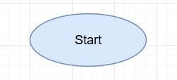
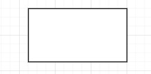
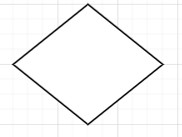
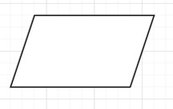
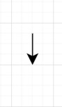
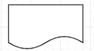

# Actividad 2: Representación de Algoritmos

## **Conceptos importantes**

### Operadores Relacionales
En la mayoria de los casos utilizamos los siguientes operadores relacionales:  
- Igual a =  
- Mayor que >  
- Mayor o igual ≥  
- Menor que <  
- Menor o igual ≤  
- Diferente ≠ 

## **Ejercicio 1**
Investiga cuáles son los símbolos que se utilizan para representar cada operación de un algoritmo con un diagrama de flujo. 

### Solución
En clase se establecieron los siguientes simbolos para emplear en un diagrama de flujo:  

*Inicio / Final:* Se utiliza para establecer el inicio de un diagrama de flujo con un elipsoide y al mismo tiempo, en el mismo diagrama, se finaliza el flujo del algoritmo con la misma figura geométrica.  
  
  

*Acción / proceso:* Representa una acción o instrucción general que debe realizarse. Se representa con un rectángulo.  

  

*Decisión:* Muestra una operación condicional de formar booleana. Se representa con un rombo.  

  

*Entrada:* Es una forma de ingresar o leer datos de entrada. Se representa con un paralelogramo.  

  

*Linea de flujo:* Muestra el orden del algoritmo o de operación de los procesos, siguiendo una lógica.    

*Muestra / Impresión:* Indica el proceso de imprimir o mostrar una variable de salida.

## **Ejercicio 2**
Construye un algoritmo que, al recibir como datos el ID del empleado y los seis primeros sueldos del año, calcule el ingreso total semestral y el promedio mensual, e imprima el ID del empleado, el ingreso total y el promedio mensual.
### Solución
Análisis

 |Variable de entrada|Descripción|
 |- |-|
 |ID |Identificación del empleado| 
 |S1, S2, S3, S4, S5, S6 |Ingreso de cada mes|

 |Variable de salida|Descripción|
 |- |-|
 |X |Ingreso total semestral| 
 |Y |Promedio mensual|
    
    Inicio
        Leer ID, S1, S2, S3, S4, S5, S6  
        X = S1+S2+S3+S4+S5+S6  
        Y = X/6  
        Mostrar ID, X ,Y  
    Fin

